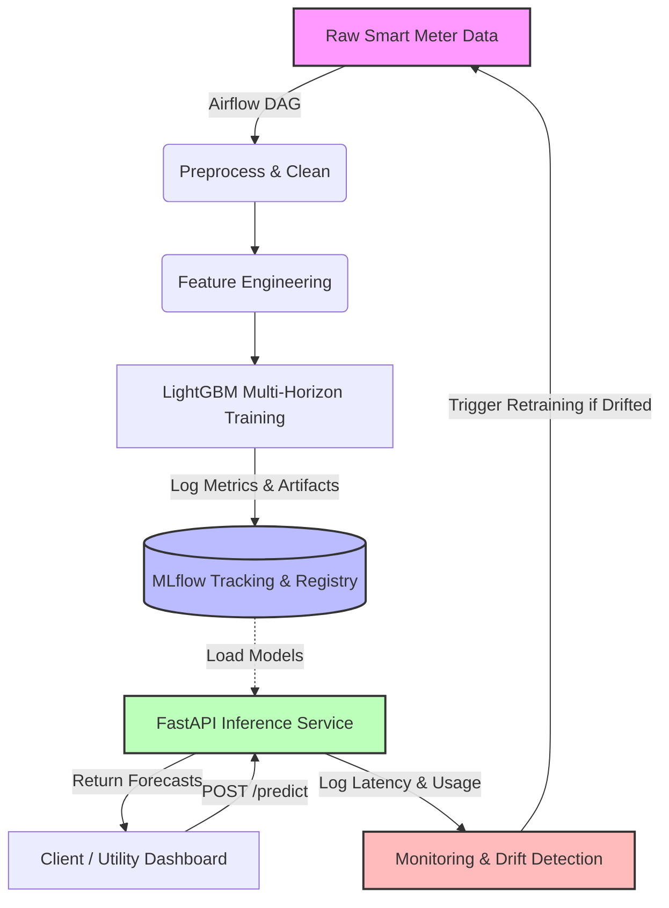

# GridCastAI Enterprise MLOps

## Project Overview
GridCastAI Enterprise MLOps is a production-grade machine learning platform built to forecast household electricity demand. The project leverages Direct Multi-Horizon Forecasting using LightGBM models. This repository demonstrates end-to-end MLOps capabilities including automated workflow orchestration, experiment tracking, model registry, containerized API serving, and CI/CD pipelines.

---

## Architecture Diagram



---

## Technology Stack
- **Modeling**: LightGBM, Pandas, Scikit-Learn
- **Experiment Tracking & Registry**: MLflow
- **Serving**: FastAPI, Uvicorn
- **Orchestration**: Apache Airflow
- **Containerization**: Docker, Docker Compose
- **Monitoring**: Python Logging, Evidently AI (Integration Logic)
- **CI/CD & Testing**: GitHub Actions, Pytest

---

## Folder Structure

```text
GridCastAI-MLOps/
├── api/
│   └── app.py                     # FastAPI serving endpoints
├── airflow/
│   └── dags/
│       └── forecast_pipeline.py   # Daily Airflow orchestration DAG
├── monitoring/
│   └── monitor.py                 # Drift and latency monitoring
├── src/
│   ├── preprocess.py              # Data cleaning and ingestion
│   ├── feature_engineering.py     # Lags, rolling, and temporal features
│   ├── train.py                   # LightGBM training with MLflow integration
│   ├── predict.py                 # Forecasting logic
│   └── utils.py                   # Logging and path utilities
├── tests/
│   └── test_pipeline.py           # Pytest unit tests
├── .github/workflows/
│   └── ci.yml                     # GitHub Actions CI/CD Pipeline
├── Dockerfile                     # API and ML Docker image
├── docker-compose.yml             # Local Multi-Container deployment
├── main.py                        # Local Orchestrator script
├── requirements.txt               # Project dependencies
└── README.md                      # Documentation
```

---

## MLOps Lifecycle & Pipeline Flow
1. **Data Ingestion**: Nightly pulls of historical electricity demand.
2. **Feature Store**: Engineering lag metrics (t-24, t-168) and rolling statistics (mean, std, max, min).
3. **Training & MLflow**: Training 24 horizon-specific LightGBM models. Hyperparameters, MAE, and RMSE are logged. The best models are stored in the MLflow Model Registry.
4. **Deployment**: Dockerized FastAPI service pulls the latest registry models into memory.
5. **Inference**: FastAPI serves `/predict` for single batches and `/batch_predict` for massive inputs.
6. **Monitoring**: Production latency, prediction counts, and concept drift are continuously logged. 

---

## How to Run (Docker Compose)
The entire stack can be launched on a standard laptop locally with a single command.

1. Clone the repository and navigate to the root directory.
2. Ensure you have Docker and Docker Compose installed.
3. Place `household_power_consumption.txt` inside the `data/` directory.
4. Run the stack:
   ```bash
   docker compose up --build
   ```

**Services Launched:**
- **FastAPI Application**: `http://localhost:8000`
- **MLflow UI**: `http://localhost:5000`
- **Airflow Standalone**: `http://localhost:8080`

*If you do not want to use Docker, you can run the localized ML pipeline via `python main.py`.*

---

## API Documentation
The FastAPI application provides a REST interface for interacting with the models.

- `GET /health` : Returns system health and model loading status.
- `GET /model/version` : Returns current model architecture version.
- `GET /metrics` : Returns Prometheus-style prediction metrics.
- `POST /predict` : Expects a JSON payload containing raw features and returns 24 hours of forecasts.
- `POST /retrain` : Triggers the underlying MLOps retraining mechanism.

You can interact with the Swagger UI at `http://localhost:8000/docs` once running.

---

## Scaling Strategy (1 Meter to 100,000+ Meters)
While this repository runs a localized demonstration on Docker, the architecture seamlessly scales:
- **Compute (Airflow/Spark)**: The Pandas preprocessing would be swapped to a PySpark DataFrame backend executing on an EMR cluster to process 100k+ meters simultaneously.
- **Serving (FastAPI/K8s)**: The Dockerized API would be deployed to a Kubernetes cluster (EKS/GKE) with Horizontal Pod Autoscaling (HPA) to handle thousands of concurrent API requests from edge devices.
- **Registry (MLflow/S3)**: The SQLite MLflow backend is replaced with a managed PostgreSQL database, and artifacts are streamed into a cloud bucket (AWS S3) rather than a local `./mlruns` directory.

---

## Business Value
By replacing simple recursive forecasting heuristics with Direct Multi-Horizon Machine Learning via LightGBM, Grid operators eliminate cascading temporal errors. By wrapping this logic in an enterprise MLflow/FastAPI/Airflow ecosystem, the utility achieves zero-downtime deployments, immediate visibility into data drift, and fully automated daily retraining, resulting in massive reductions in peak-generation costs.

---

## Business Questions & Analysis

**1. What would you change if you had to forecast for hundreds of thousands of meters at once instead of one?**
* **Data Infrastructure**: Scaling from a single meter requires shifting from local, in-memory Pandas processing to distributed MLOps using frameworks like Apache Spark (PySpark). The raw streaming data would be ingested into scalable time-series databases like Snowflake or TimescaleDB.
* **Modeling Approach**: Training and maintaining 100,000 distinct "local" models is an operational bottleneck. I would pivot to a **Global Forecasting Model** (training a single, highly generalized model like LightGBM or a Temporal Fusion Transformer across all meters simultaneously). To ensure accuracy for individual households, I would inject static metadata features (e.g., `meter_id`, `household_size`, `geographic_zone`) allowing the model to learn global patterns while respecting localized baselines.
* **Pipeline Automation**: The inference pipeline would be heavily containerized via Kubernetes (EKS/GKE) for elastic scaling to process batch forecasts asynchronously during off-peak hours.

**2. What are the key drivers of electricity demand according to the model?**
According to the `feature_importances_` extracted from the LightGBM models during training, the dominant drivers of electricity demand are:
* **Recent Autoregressive Lags (`lag_1`, `lag_2`, `lag_24`)**: The absolute most predictive signal for current demand is what the demand was exactly 1 hour ago, and what it was at this exact same hour yesterday.
* **Temporal & Cyclical Features (`hour`, `hour_sin`, `hour_cos`)**: Human behavior dictates electricity usage. The time of day (morning routines, evening peaks when families return home) strongly partitions the model's decision trees.
* **Rolling Volatility (`rolling_range_24`, `rolling_std_24`)**: Identifying whether the household is currently in a highly volatile usage state or a dormant baseline state heavily influences the magnitude of the predicted spikes.
